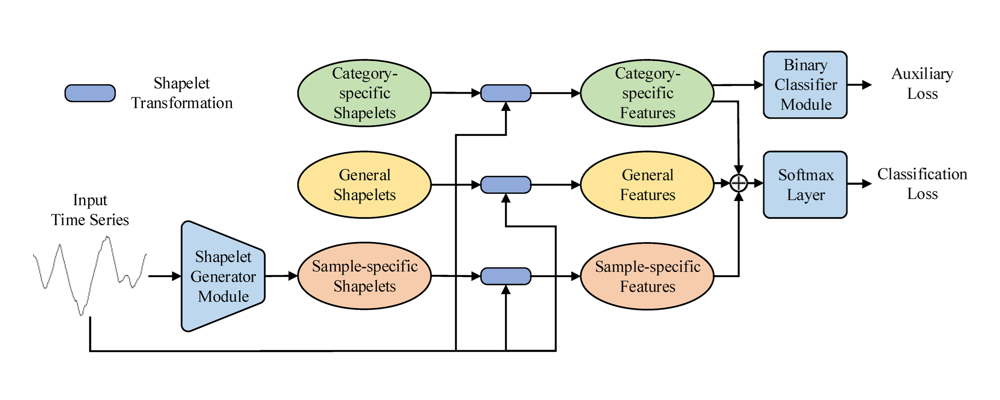
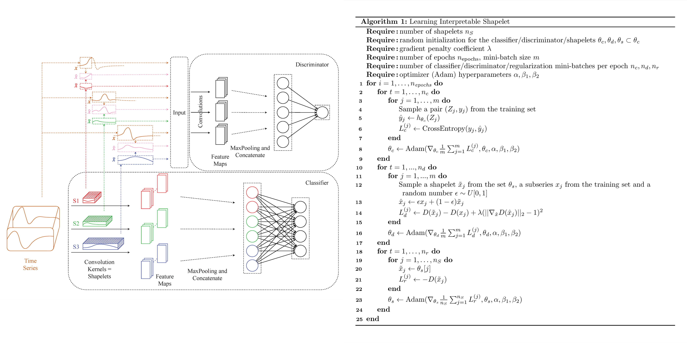
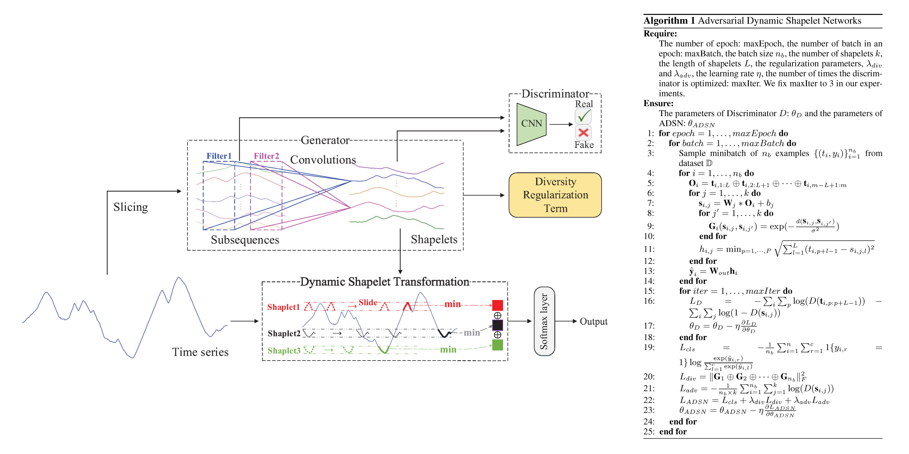
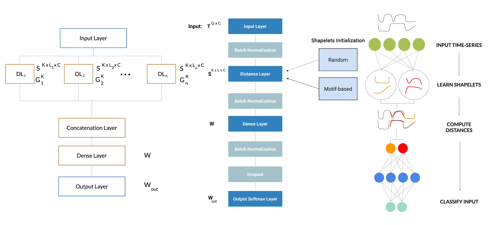

# Shapelet with Neural Network

## **Symbol Table**

| | Itself | Length | Number | Iterator |
| -: | :-: | :-: | :-: | :-: |
| Time series | $s$ | $l$ | $n$ | $i$ |
| Subsequences | $t$ | $m$ | $(l-m+1)$ | $p$ |
| Shapelets | $v$ | $m$ | $k$ | $j$ |
| Categories | $\textbf{y} _ i$ | - | $N _ \textrm{cat}$ | $c$ |

## SOINN: [Yang, 2016](https://doi.org/10.1109/ICTAI.2016.0071)
- Learning candidates: **SOINN** (online unsupervised) learns the topological structure & reports clusters
- Data transformation: $\textrm{similarity} = e^{-\alpha \frac{\textrm{sdist}(t, v)}{T _ P}}$, $T _ P$ is a threshold learned by SOINN (denser data, small $T _ P$)
- Shapelets selection: learn a *sparse* weight matrix with **SVM** (L1-reg): $\textrm{loss} = C\sum _ i \max(0, 1-y _ i w^T x _ i)^2 + \sum _ j |w _ j|$
    - Candidates with associated weights being all zeros are removed

## Triple shapelet network: [Ma, 2019](https://doi.org/10.1109/ICDM.2019.00155) -- **Categorial & dynamic, 3 scope levels**
- Current issues: classification accuracy vs. distinguishing power of the minority class; fixed shapelets
- "Triple": dataset-level (softmax outputs), category-level (binary auxiliary classifier), sample-level (shapelet generator)
- **Dataset-level**: $k$ shapelets; use shapelet transform to generate feature $\textbf{h} _ i^D$
- **Category-level**: $k' = \lceil\frac{k}{N _ \textrm{cat}}\rceil$ shapelets *per category*; the $j^\textrm{th}$ category has feature $\textbf{h} _ {i, j}^C$ ($N _ \textrm{cat}$ in total)
- **Sample-level**: Convolve over concat. subseqs.: $v _ j = \textbf{W} _ j \ast \textbf{O} + b _ j$ is the $j^\textrm{th}$ generated shapelet ($k$ in total), feature $\textbf{h} _ i^S$
    - $L$ is the length, $P$ is the number of subsequences; $\textbf{W} _ j \in \Bbb{R}^{5 \times P}$, $\textbf{O} \in \Bbb{R}^{L \times P}$, $b _ j \in \Bbb{R}$
- **Classification loss**: pred. value $P = \textrm{softmax}(\textbf{W}^\textrm{out}\textrm{concat}(h _ i^D, h _ i^C, h _ i^S))$; $\textbf{W}^\textrm{out} \in \Bbb{R}^{N _ \textrm{cat} \times 3k}$, $h _ i^\ast \in \Bbb{R}^k$
- **Auxiliary loss**: pred. value $P = \sigma(\textbf{w} \cdot \textbf{h})$; $\textbf{w} \in \Bbb{R}^{N _ \textrm{cat} \times k'}$, $\textbf{h} \in \Bbb{R}^{k'}$ (no concat., otherwise deprecated to dataset-level)
- Learnables: dataset-level, category-level shapelets; $\textbf{W} _ j$, $b _ j$ (sample-level conv.), $\textbf{W}^\textrm{out}$ (cls. loss), $\textbf{w}$ (aux. loss)

## Adversarial regulatization: [Wang, 2019](https://doi.org/10.48550/arXiv.1906.00917) -- **GAN, 3 optimization steps**
- A discriminator is trained to distinguish between shapelets and subsequences
- **Optimize classifier step**: Dot product (softmaxed distance vector, learn weight vector) -> pred value, optimize $\theta _ c$
- **Optimize discriminator step**: $\textrm{loss} = ||v _ j||^2 - ||t _ j||^2 + \lambda(||\partial(\epsilon t _ j + (1-\epsilon) v _ j)||^2 - 1)$ (***??????***), optimize $\theta _ d$
- **Optimize shapelet step**: $\textrm{loss} = -||v _ j||^2$, optimize $\theta _ s$ (Note: $\theta _ s$ are the shapelets themselves!)
- Losses: classifier - multi-class cross entropy, discriminator - WGAN-GP, shapelet - normal length

## Adversarial dynamic shapelet network: [Ma, 2020](https://doi.org/10.1609/AAAI.v34i04.5948) -- **Global conv. kernels, 3 losses**
- Current issues: shapelets deviate from the subsequences ("adversarial"); fixed shapelets ("dynamic")
- **Shapelet generator**: same as ("Sample-level", TSN)
- **Dynamic shapelet transformation**: $P = \textrm{softmax}(\textbf{W}^\textrm{out}h _ i)$; $\textbf{W}^\textrm{out} \in \Bbb{R}^{N _ \textrm{cat} \times k}$, $h _ i \in \Bbb{R}^k$ - *fully dynamic???*
- **Adversarial training strategy**: "two-player minimax game"; $D$ is a *two-layer conv-nn*
- **Diversity Regularization Term**: $\textrm{similarity} = e^{-||\Delta d||}$
- Losses: $L _ \textrm{cls}$ - cross entropy, $L _ \textrm{adv}$ - $-\frac{1}{nk}\sum _ {i=1}^n\sum _ {j=1}^k\log(\textrm{discriminator}(t _ i, v _ j))$, $L _ \textrm{div}$ - Frobenius norm
- ### Complete pseudo-code
    - Hyperparameters: $n _ E$ (num. epochs), $n _ B$ (batch size), $k$, $m$, $\eta$ (learning rate), $\lambda _ \textrm{Adv}$, $\lambda _ \textrm{Div}$ (regularization params.)
    - Learnables: $\textbf{W} _ j$, $b _ j$ (conv. kernels), $\textbf{W} _ \textrm{out}$ (linear classification layer), $\theta _ D$ (conv-nn), $\theta _ \textrm{ADSN}$ (ensemble of params.)
    - For $n _ E$ epochs and $\lceil\frac{n}{n _ B}\rceil$ batches
        - For time series $i = 1 : n _ B$
            - Concatenate subsequences into matrix $\textbf{O} _ i \in \Bbb{R}^{m \times (l-m+1)}$
            - For "dynamic" shapelets $j = 1 : k$
                - Compute shapelet $v _ {i, j} = \textbf{W} _ j \ast \textbf{O} _ i + b _ j$ ($\textbf{W} _ j \in \Bbb{R}^{\textrm{width} \times (l-m+1)}$, $b _ j \in \Bbb{R}$)
                - Compute distance $h _ {i, j} = \min _ {p = 1 : (l-m+1)} |v _ {i, j} - t _ {i, p}|$
            - Compute predicted category $\hat{\textbf{y}} _ i = \textrm{Softmax}(\textbf{W} _ \textrm{out} \textbf{h} _ i)$ ($\textbf{W} _ \textrm{out} \in \Bbb{R}^{N _ \textrm{cat} \times k}$, $\textbf{h} _ i \in \Bbb{R}^k$, $\hat{\textbf{y}} _ i \in \Bbb{R}^{N _ \textrm{cat}}$)
            - Compute similarity matrix $\textbf{G} _ i [j, j'] = e^{-|v _ {i, j} - v _ {i, j'}|}$ ($\textbf{G} _ i \in \Bbb{R}^{k \times k}$; vectorization may apply)
        - For $\textrm{numIter}$ cycles of learning discriminator $D$
            - Compute $L _ D = -\sum _ i \sum _ p \log D(t _ {i, p}) -\sum _ i \sum _ j \log D(1-v _ {i, j})$ ($D(\cdot)$ - similarity to real subseqs.)
            - SGD the parameters: $\theta _ D = \theta _ D - \eta \frac{\partial L _ D}{\partial \theta _ D}$
        - Compute $\textrm{Loss} _ \textrm{Classification} = -\frac{1}{n _ B} \sum _ i \sum _ c \textbf{y} _ {i, c} \hat{\textbf{y}} _ {i, c}$ (maximize predicted value at correct category)
        - Compute $\textrm{Loss} _ \textrm{Adversarial} = -\frac{1}{n _ B k} \sum _ i \sum _ j \log D(v _ {i, j})$ (maximize shapelets' similarity to subseqs.)
        - Compute $\textrm{Loss} _ \textrm{Diversity} = ||\textrm{Concat} (\textbf{G} _ 1, \ldots, \textbf{G} _ {n _ B})||^2 _ F$ (minimize shapelets' similarity to each other)
        - Compute $L _ \textrm{ADSN} = \textrm{Loss} _ \textrm{Cls} + \lambda _ \textrm{Adv} \textrm{Loss} _ \textrm{Adv} + \lambda _ \textrm{Div} \textrm{Loss} _ \textrm{Div}$
        - SGD the parameters: $\theta _ \textrm{ADSN} = \theta _ \textrm{ADSN} - \eta \frac{\partial L _ \textrm{ADSN}}{\partial \theta _ \textrm{ADSN}}$

## Convolutional transfer: [DeSouza, 2021](https://doi.org/10.1007/978-3-030-91699-2_23)
- General idea: *decompose* the time series (O) into shapelets (S) and noise (N), train *two classifiers* separately (pre-initialization)
- O w/rand, S w/rand, O w/S, N w/rand, O w/N, S w/N, N w/S

## Multivar ShapeNet: [Li, 2021](https://ojs.aaai.org/index.php/AAAI/article/view/17018) -- **Mdc-CNN, 4 unsup. "clustering" losses**
- **Multi-length-input dilated causal CNN**: embed shapelet candidates of different lengths into a *unified space* for selection
    - Residual blocks + (global maxpool + linear) --> *shared weights*
    - *Dilated*: blanks in the hidden layers, achieves exponentially large receptive field
    - *Causal*: no future value <==> no connections with "negative slope" (fig. bottom right)
- ***Unsupervised* representation training**: *cluster-wise triplet loss* considers the distance between (anchor, Ps, Ns)
    - "Single positive" is unstable; CWT minimizes $\mathcal{D} _ {AP}$, $\mathcal{D} _ {PP}$, $\mathcal{D} _ {NN}$, maximizes $\mathcal{D} _ {AN}$
    - $\mathcal{D} _ {AP} = \frac{1}{||\textbf{x}^+||} \sum _ i ||f(x)-f(x _ i^+)||^2$, $\mathcal{D} _ {AN} = \frac{1}{||\textbf{x}^-||} \sum _ i ||f(x)-f(x _ i^-)||^2$ - $f(\cdot)$ is Mdc-CNN ^
    - $\mathcal{D} _ {PP} = \max _ {1 \le i, j \le ||\textbf{x}^+||} ||f(x _ i^+)-f(x _ j^+)||^2$, $\mathcal{D} _ {PP} = \max _ {1 \le i, j \le ||\textbf{x}^-||} ||f(x _ i^-)-f(x _ j^-)||^2$
    - $L _ \textrm{CWT} = \log \frac{\mathcal{D} _ {AP}+\mu}{\mathcal{D} _ {AN}} + \lambda (\mathcal{D} _ {PP}+\mathcal{D} _ {NN})$ - $\mu$ is the "enforced P-N margin"; $\lambda$ is hyperparam.
    - *Note: how can we call this approach "unsupervised" if we can tell the positive samples from the negative ones?*
- **Multivar shapelet transform**: Compute *representative and diversified* final shapelets rather than using all embeddings
    - Final shapelets should be (1) *close* to the centroid of a *large* cluster and (2) *far* from other clusters - select top-$k$
        - $\mathcal{U}(f(x _ i)) = \beta \frac{\log \textrm{ClusterSize}(f(x _ i))}{\log \max _ i \textrm{ClusterSize}(f(x _ i))} + (1-\beta) \frac{\log \sum _ j ||f(x _ i)-f(x _ j)||^2}{\log \max _ i \sum _ j ||f(x _ i)-f(x _ j)||^2}$ - $1 \le i, j \le \textrm{NumClusters}$
        - This avoids a large fraction of computing non-discriminative shapelet candidates
        - Finally, adopt a classical classifier (e.g., SVM)

## Multivar Multi-layer NN: [Medico, 2021](https://doi.org/10.1007/s11634-021-00437-8) -- **Shapelets as weights, 3 losses**
- **Multi-layer neural network**: BatchNorm, *Distance*, BatchNorm, *Linear(s) + ReLU*, BatchNorm, Dropout, *Softmax*
    - Distance layer: Shapelets *themselves* are the weights! 
    - Initialize $\textbf{S}$ using KMeans on each channel
- **Learning objective**: three components:
    - $\textrm{Loss} _ \textrm{Classification} = -\sum _ i y _ i \log \hat{y} _ i$
    - $\textrm{Loss} _ \textrm{Redundancy} = \sum _ j \frac{\sigma(G _ j)}{k}$, $\sigma(G _ j) = \frac{1}{1+e^{-\theta G _ j}}$ - $\textbf{G} \in \Bbb{R}^k$ (gating params.), $\theta$ $\gg 1$
        - Suppress **redundant** shapelets: sigmoid forces $\textbf{G}$ to be *binary*
    - $\textrm{Loss} _ \textrm{Correlation} = \max _ {i, j} |\textrm{CorrMat}(\textbf{M} \cdot \textrm{diag}(\sigma(G _ j))) _ {ij}|$, $M _ {ij} = \textrm{dist}(s _ i, v _ j)$
        - Suppress **similar** shapelets: now $\textbf{G}$ is part of the differentiable computing graph! 
    - $L _ \textrm{MLNN} = (1-\alpha) \textrm{Loss} _ \textrm{Cls} + \alpha (\textrm{Loss} _ \textrm{Rdn} + \textrm{Loss} _ \textrm{Corr})$, $\alpha \in [0, \frac{1}{2}]$ (cosine cyclic scheduling: H - discard, L - refine)
        - Learnables: weights $\textbf{W}$ (Linear & Softmax, cls), shapelets $\textbf{S}$ & gatings $\textbf{G}$ (Distance, rdn & corr)
        - This objective selects *smaller* sets of *uncorrelated* shapelets (no selection of hyperparams. like $k$ and $m$)

## Time2Vec: [Kazemi, 2019](https://doi.org/10.48550/arXiv.1907.05321)
- Key properties
    - Capturing (non-)**periodic** patterns
    - Being **invarient** to time scaling
    - Being **simple** enough for model combination
- $\textrm{Time2Vec}(t)[i] = \mathcal{F}(\omega _ i t + \tau _ i)$ - $\mathcal{F}$ is periodic activation, $\omega _ i$ & $\tau _ i$ are learnable params.

 

# Digest: Possible Technological Paths

## Previously……
- [Time2Graph](https://doi.org/10.1609/AAAI.v34i04.5769) as a Finite State Machine
- "Possibilities" in the state transition diagram: from $t$-$v$ distance to learned embedding vectors

## The journey of research
- First thoughts: unsupervised framework to generate shapelets without labels?
    - GAN, variational encoder, etc. 
    - Hardly moves away from the $t$-$v$ distance
    - Generative models only aim to map similar inputs to similar outputs (makes no difference in clustering)
- After hitting the dead end: finding *diverse* shapelets
    - [ADSN](https://doi.org/10.1609/AAAI.v34i04.5948): generative + dynamic model
        - Exigency: learned shapelets may be very different from the subsequences
        - Methodology: sample-wise ("dynamic") shapelets - convolve the subsequences, discriminate with GAN
        - Issue: how can shapelets generated "on the fly" represent *global* features? 
    - [ShapeNet](https://ojs.aaai.org/index.php/AAAI/article/view/17018): moves away from the traditional "classification" criterion
        - Exigency: in multivar. TS, it's hard to compare shapelets with various lengths
        - Methodology: embed the subsequences into a unified space, select *large and isolated* clusters
        - Issue: why don't we directly cluster the subsequences? 

## Useful Components
- **Category- & sample-level ("dynamic") shapelets**: learned (global) convolution kernels
    - Does it make sense to get rid of global *shapelets*? We don't want to compare a series to itself
- **Generative adversarial network**: update classifier -> disriminator (multi-layer conv-nn) -> shapelets consecutively
    - Coding could be massive…… and GAN requires a brand new field of background knowledge
- **Dilated causal CNN**: no future values, with blanks. *((conv, norm, relu) * 2, res) * 3, maxpool, linear, softmax*
    - It's considerate to be *causal*, yet it (1) is computationally expensive and (2) simply "tightens" clusters
- **Multi-layer NN**: shapelets themselves as weights; motif-based init. *linear, relu, dropout, softmax*
    - Seems old-fashioned, but a similar MLP could be useful; think twice on param. initialization
- **All kinds of losses**
    - Classification (cross entropy, **encourage accuracy**) - this is a must
    - Adversarial ($v$-$t$ similarity, **encourage "beautiful" shapelets**) - see above for the GAN issues…… :-L
    - Diversity / Correlation ($v$-$v$ similarity, **encourage diverse shapelets**) - redundant with clustering selection
    - Redundancy (w/gating params., **encourage less shapelets**) - auto-tuning of "$k$"-means
    - Triplet ($A$-$P$-$N$, **encourage clear-cut clusters**) - picking good samples of $P$ and $N$ could be an issue

## Improved algorithm outline
- Unsupervised labelling: pick the "anchor" shapelets with KMeans, calculate $t$-$v$ distances as labels
- **Unsupervised step**: *contrastively* train an embedding network $\mathcal{U}$ to extract $t$'s features
- Supervised labelling: feed $t$ and $v$ into $\mathcal{U}$, use the E.D. of *output vectors* as the "distance" labels
- **Supervised step**: concatenate an MLP $\mathcal{S}$ after the unsupervised model, use the labels ^ for fine-tuning
- The model is then ready. For each $s$, transfer its $t$ into possibility vectors and contruct the FSM Diagram

## More on picking shapelet candidates
- Randomly pick among the segments
- **KMeans** algorithm: classify $t$ into clusters, choose the center of each
    - Clustering encourages **representative** shapelets, but **diversity** requires more thoughts
    - A mature algrm. for speeding up (in $O(n)$ time)
    - [ShapeNet](https://ojs.aaai.org/index.php/AAAI/article/view/17018) shows the plausibility of selection via clustering
        - ^ modified ver.: choose the centroids in the *nn-learned* embedding space (WHAT FOR?)

## Other possibilities
- Graph Learning Method: **GIN** (Graph Isomorphism Network)
- Make use of different time scales: 1 month, 3 months, 6 months
- Use deep learning to learn the shapelets (as proposed above)
